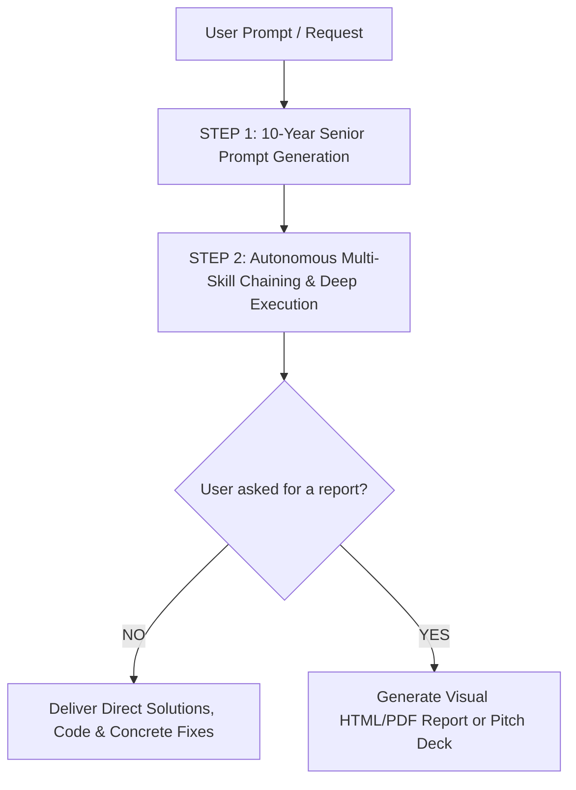

# 🚀 Antigravity AI Skills & Local SEO Operating System

> **Transform Claude Code, Antigravity IDE, Cursor, and AI Agents into an elite, 10-Year Experienced Senior Full-Stack Engineer and Local SEO Director. Includes 127 specialized autonomous skills, zero-assumption prompt architecture, and enterprise SEO frameworks.**

<div align="center">

[](https://jahidulislam.dev)
[](LICENSE)
[]()
[]()
[]()
[](https://github.com/jahidulislamseo/antigravity-ai-skills/stargazers)

<p align="center">
  <a href="#-why-this-exists-how-it-helps-you">Why This Exists</a> •
  <a href="#-1-click-instant-installation">Fast Install</a> •
  <a href="#-how-this-helps-you-real-world-benefits">How It Helps You</a> •
  <a href="#-the-permanent-3-step-execution-engine">3-Step Engine</a> •
  <a href="#-the-127-skills-directory">Skills Directory</a> •
  <a href="#-case-study--blueprint">Case Study</a>
</p>

</div>

---

## 💥 The Problem With Standard AI

Most AI models give **superficial, textbook answers** when asked to code or audit a business:
- ❌ *"Regularly post on your Google Business Profile and write good content."* (Zero actionable value).
- ❌ *"This fix will increase your traffic by 40%."* (Hallucinated, fake percentage guarantees).
- ❌ Buggy boilerplate code filled with `// TODO: implement later` and zero security hardening.
- ❌ Inability to say *"I don't know"* when data is missing—resulting in fabricated claims.

### 🛡️ The Antigravity Solution: 10-Year Senior Rigor
This repository installs a **complete autonomous operating system** into your AI agent with **127 specialized skills** and a strict **Zero-Assumption, Evidence-First Directive**. Your AI immediately shifts from a junior chatterbox into a seasoned Principal Engineer and Senior Local Search Consultant.

---

## ⚡ 1-Click Instant Installation

Open your terminal on **macOS** or **Linux** and run:

```bash
git clone https://github.com/jahidulislamseo/antigravity-ai-skills.git && cd antigravity-ai-skills && ./install.sh
```

### What happens automatically:
1. All **127 skills** are safely installed into `~/.gemini/config/skills/`.
2. The **3-Step Autonomous Workflow** & **Anti-AI Slop Rules** are permanently activated in `~/.gemini/config/GEMINI.md`.
3. Works instantly across **Antigravity IDE**, **Claude Code**, and compatible agent hosts.

*Windows users: Run inside WSL (Windows Subsystem for Linux) or Git Bash.*

---

## 🌟 How This Helps You (Real-World Benefits)

| User Persona | Before Using This OS | With Antigravity AI Skills |
| :--- | :--- | :--- |
| **🏢 SEO Agencies & Consultants** | Spending 10+ hours per client writing manual audits and calculating review velocity. | **Automate 80% of audits in minutes.** Run full GBP diagnostics, geogrid scans, schema markup, and generate client pitch decks with zero fluff. |
| **💻 Full-Stack Developers** | Spending hours debugging AI-generated broken code without tests or type safety. | **Production-ready code on the first pass.** Autonomously loads Next.js 14 RSC, FastAPI, Postgres tuning, OWASP security checks, and unit tests. |
| **📍 Local Business Owners** | Locked out of the Google 3-Pack; losing local calls to competitors. | **Diagnose root causes immediately.** Detect category dilution, fix NAP inconsistencies, build Apple Maps & Bing profiles, and launch review campaigns. |
| **🧠 Prompt Engineers** | Getting weak outputs from vague, one-line prompts. | **Automatic 10/10 Prompt Refactoring.** The built-in `expert-prompt-architect` transforms casual thoughts into high-rigor ROCS-EO master prompts. |

---

## 🧠 The Permanent 3-Step Execution Engine

Every task you give the AI follows this unbreakable operational workflow:



1. **STEP 1: 10-Year Senior Prompt Generation**  
   Before executing, the system calibrates a master prompt using the **ROCS-EO Framework** (Role, Objective, Constraints, System process, Evidence schema, Output contract).
2. **STEP 2: Skill-Based Deep Execution**  
   Autonomously selects and chains the exact skills needed (e.g. `gbp-optimization` ➔ `local-schema` ➔ `review-management`).
3. **STEP 3: Report Gating (Anti-Fluff Protocol)**  
   The AI **never** buries you in unsolicited 10-page audit decks unless you explicitly ask for a client report. You get the direct solution immediately.

---

## 📚 The 127 Skills Directory

### 📍 1. Local SEO, GBP & Reputation (39 Skills)
* **Google Business Profile & 3-Pack:** `gbp-optimization`, `geogrid-analysis`, `service-area-seo`, `gbp-posts`, `gbp-suspension-recovery`, `gbp-api-automation`.
* **Reviews & Social Proof:** `review-management` (Velocity formula, keyword prompts, sentiment responses).
* **Local Citations & Multi-Platform:** `local-citations`, `apple-business-connect`, `bing-places`.
* **On-Page Geo & Schema:** `local-schema` (Dentist/LocalBusiness JSON-LD), `local-landing-pages`.
* **AI Search & Local GEO:** `ai-local-search` (Google AI Overviews, SearchGPT, Perplexity Local).
* **Audits & Data Connectors:** `local-seo-audit`, `local-reporting`, `client-deliverables`, `localseodata-tool`, `local-falcon-tool`, `brightlocal-tool`, `whitespark-tool`, `dataforseo-tool`.

### 🌐 2. Organic SEO, GEO & Content Intelligence (18 Skills)
* **Research & Gap Mapping:** `keyword-research`, `competitor-analysis`, `serp-analysis`, `content-gap-analysis`.
* **Content Generation & Anti-AI Slop:** `human-first-writer` (Wikipedia-grounded anti-slop & cadence engine), `content-writer` (CORE-EEAT & intent-driven), `geo-content-optimizer`, `serp-markup-builder`, `page-play-builder` (pSEO & parasite plays).
* **Auditing & Tuning:** `content-quality-auditor`, `on-page-seo-checker`, `site-structure-optimizer`, `technical-seo-checker`, `domain-authority-auditor`, `rank-tracker`, `performance-monitor`, `offsite-signal-analyzer`, `entity-optimizer`.

### 💻 3. Full-Stack Software Engineering (67 Skills)
* **Frontend & Mobile:** `nextjs-developer`, `react-expert`, `vue-expert`, `angular-architect`, `react-native-expert`, `flutter-expert`.
* **Backend Frameworks:** `fastapi-expert`, `nestjs-expert`, `django-expert`, `django-storages-s3`, `spring-boot-engineer`, `laravel-specialist`, `dotnet-core-expert`, `rails-expert`.
* **Programming Languages:** `typescript-pro`, `python-pro`, `golang-pro`, `rust-engineer`, `cpp-pro`, `csharp-developer`, `java-architect`, `kotlin-specialist`, `swift-expert`, `sql-pro`, `php-pro`.
* **Cloud, DevOps & Databases:** `kubernetes-specialist`, `terraform-engineer`, `cloud-architect`, `devops-engineer`, `sre-engineer`, `postgres-pro`, `database-optimizer`.
* **Architecture, Security & Quality:** `architecture-designer`, `microservices-architect`, `api-designer`, `graphql-architect`, `secure-code-guardian` (OWASP), `security-reviewer`, `test-master`, `debugging-wizard`, `code-reviewer`.

### 📊 4. Visual Reporting & Presentations (3 Skills)
* **`agency-visual-report`**: Generates standalone interactive HTML dashboards and print-ready PDF client deliverables with color-coded geogrid heatmaps and SVG charts.
* **`powerpoint-keynote-presentation`**: Prepares persuasive, slide-by-slide executive pitch deck narrative outlines for client meetings.
* **`expert-prompt-architect`**: Transforms simple requests into 10-year senior prompts.

---

## 📖 Real-World Case Study: Amethyst Dental (Victorville, CA)
Included inside [`blueprints/AI_MASTER_OS_AND_LOCAL_SEO_BLUEPRINT.md`](blueprints/AI_MASTER_OS_AND_LOCAL_SEO_BLUEPRINT.md):
- **Root-Cause Analysis:** Category dilution (8 mixed specialties on a general practice), missing `Emergency dental service` category, and insecure HTTP website URL.
- **Production-Ready Schema:** Complete validated `Dentist` JSON-LD schema with `geoCoordinates`, `openingHoursSpecification`, `medicalSpecialty`, and `hasMap`.
- **Action Matrix:** P0-P2 prioritized fixes that can be executed immediately.

---

## 🤝 Contributing & Community

Contributions are welcome! If you have built or refined specialized AI skills:
1. Fork the repo.
2. Create a new branch: `git checkout -b feature/new-skill`.
3. Add your skill directory with a standardized `SKILL.md`.
4. Submit a Pull Request.

---

## 📜 License
Released under the [MIT License](LICENSE). Feel free to use, customize, and deploy across personal or enterprise client projects.

---

<div align="center">

**Built with ❤️ for the AI Engineering & Local SEO Community**  
Author: [Jahidul Islam](https://github.com/jahidulislamseo)

⭐ **If you find this repository helpful, please star it on GitHub!** ⭐

</div>
